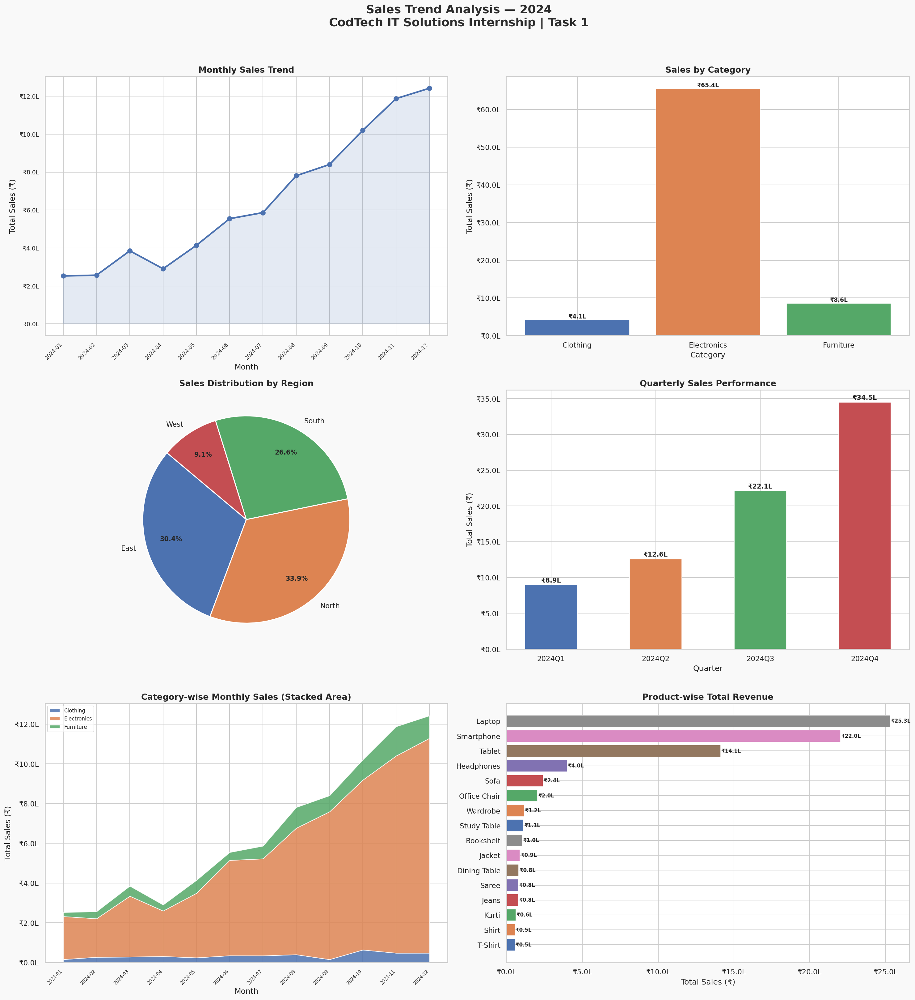

# 📊 Task — Sales Trend Visualization

<p align="center">
  
</p>

---

## 👤 Intern Information

| Field | Details |
|---|---|
| **Intern Name** | Dhananjay Gope |
| **Intern ID** | CITS2681 |
| **Company** | CODTECH IT Solutions Pvt. Ltd |
| **Domain** | Data Analytics |
| **Task** | Sales Trend Visualization |
| **Mentor** | Neela Santhosh Kumar |
| **Duration** | 4 Weeks |

---


## 📌 Objective

Analyze a retail sales dataset and create **meaningful visualizations** to identify:
- Monthly and quarterly sales trends
- Category-wise and product-wise revenue breakdown
- Region-wise sales distribution

---

## 📁 Files in This Repository

```
Task-_Sales-Trend-Visualization/
│
├── sales_data.csv               # Dataset used for analysis (92 records, 2024)
├── sales_trend_analysis.py      # Python script for data analysis & visualization
├── sales_trend_analysis.png     # Output chart (6 visualizations)
└── README.md                    # Project documentation (this file)
```

---

## 🛠️ Technologies Used

| Tool / Library  | Purpose                                 |
|-----------------|-----------------------------------------|
| Python 3.14.5      | Core programming language               |
| Pandas          | Data loading, cleaning, and aggregation |
| Matplotlib      | Plotting charts and graphs              |
| Seaborn         | Enhanced chart styling and themes       |

---

## 📊 Dataset Overview

- **File:** `sales_data.csv`
- **Records:** 92 transactions
- **Period:** January 2024 – December 2024
- **Columns:**

| Column       | Description                          |
|--------------|--------------------------------------|
| Order_ID     | Unique order identifier              |
| Date         | Date of transaction                  |
| Category     | Product category (Electronics, etc.) |
| Product      | Product name                         |
| Region       | Sales region (North/South/East/West) |
| Quantity     | Units sold                           |
| Unit_Price   | Price per unit (₹)                   |
| Total_Sales  | Total revenue (Quantity × Unit_Price)|

---

## 📈 Visualizations Created

The output PNG contains **6 charts**:

1. **📉 Monthly Sales Trend** — Line chart showing revenue growth from Jan to Dec 2024
2. **📊 Sales by Category** — Bar chart comparing Electronics, Clothing & Furniture revenue
3. **🥧 Sales by Region** — Pie chart showing North/South/East/West distribution
4. **📦 Quarterly Performance** — Bar chart for Q1–Q4 revenue comparison
5. **🎨 Stacked Area Chart** — Category-wise monthly breakdown over the year
6. **📋 Product Revenue** — Horizontal bar chart ranking products by total revenue

---

## 🔑 Key Findings

- 💰 **Total Revenue:** ₹78,10,990 across 92 orders
- 📅 **Best Month:** December 2024 (festive season surge)
- 🏆 **Top Category:** Electronics (highest revenue contributor)
- 🌍 **Top Region:** North
- 🥇 **Top Product:** Laptop

---

## ▶️ How to Run

### Step 1 — Clone the repository
```bash
git clone https://github.com/[YOUR-GITHUB-USERNAME]/CodTech-DataAnalytics-Internship.git
cd CodTech-DataAnalytics-Internship/Task-1_Sales-Trend-Visualization
```

### Step 2 — Install dependencies
```bash
pip install pandas matplotlib seaborn
```

### Step 3 — Run the script
```bash
python sales_trend_analysis.py
```

The chart will be saved as `sales_trend_analysis.png` in the same folder.


